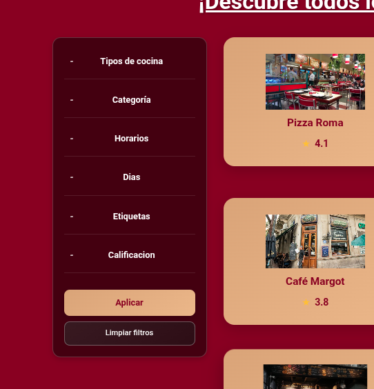
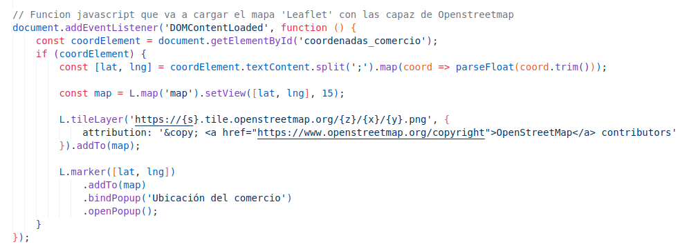
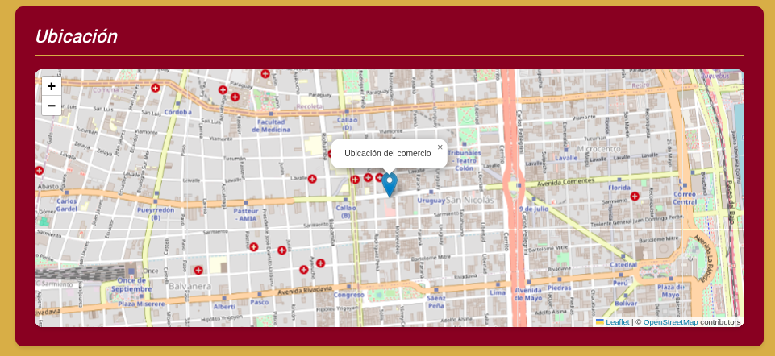
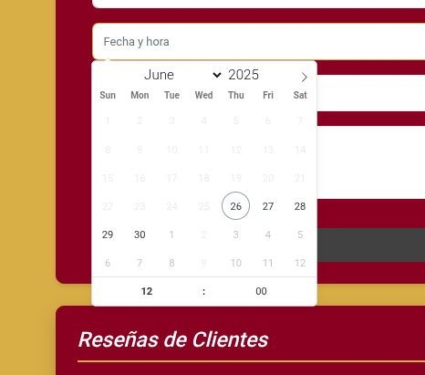

# FoodyBA – Trabajo Práctico Final FIUBA

## Descripción del proyecto

**FoodyBA** es una aplicación web donde los usuarios podrán buscar restaurantes, consultar reseñas realizadas por otros y dejar sus propias opiniones y calificaciones. La plataforma está pensada para ser intuitiva y funcional, permitiendo a cualquier usuario encontrar lugares para comer según criterios como tipo de comida, ubicación o calificación.

Además, ofrece herramientas a los comerciantes para administrar su restaurante, recibir reservas y acceder a estadísticas útiles, mejorando su visibilidad y conexión con potenciales clientes.

Este proyecto se desarrolla como trabajo práctico integrador de la materia **Introducción al Desarrollo de Software (FIUBA)**, siguiendo una metodología ágil basada en tareas asignadas en un tablero Kanban, control de versiones con GitHub y entregas progresivas que generen valor funcional.

---

## Objetivos del proyecto

* Brindar a los usuarios una herramienta para descubrir y calificar restaurantes.
* Fomentar la interacción entre usuarios a través de reseñas y reservas.
* Facilitar a los comercios la gestión online de su presencia gastronómica.
* Aplicar conocimientos adquiridos en el curso (backend, frontend, base de datos, trabajo en equipo).
* Presentar un proyecto funcional, organizado y bien documentado.

---

## Progreso final del proyecto

* ✅ Proyecto definido y planificado
* ✅ Mockup visual completo
* ✅ Backlog en Trello con tareas divididas por integrante
* ✅ Rutas de autenticación para consumidores y comercios
* ✅ Sistema de reservas con validación por día y horario
* ✅ Perfiles diferenciados para cada tipo de usuario
* ✅ Reseñas con sistema de calificación y comentarios
* ✅ Sistema de favoritos funcional
* ✅ Filtros de búsqueda por cocina, etiquetas, días, horarios y calificación
* ✅ Mapa integrado para visualizar ubicación de restaurantes
* ✅ Documentación técnica completa
* ✅ Testing y verificación de funcionalidades

---

## Herramientas utilizadas

* **Backend**: Flask (Python)
* **Base de datos**: MySQL
* **Frontend**: HTML, CSS, Jinja, JavaScript
* **Mapas**: Leaflet/OpenStreetMap
* **Calendario para reservar**: Flatpickr
* **Control de versiones**: GitHub
* **Organización del trabajo**: Trello (Kanban)

---
## Solución propuesta

Para satisfacer la necesidad de los usuarios de encontrar y calificar restaurantes de una manera simple, desarrollamos FoodyBA como una plataforma que conecta consumidor y comercios. Nuestra solución permite a los usuarios buscar restaurantes mediante filtros avanzados, consultar reseñas, dejar opiniones y gestionar reservas en tiempo real. Desde el aspecto de los comercios pusimos el foco en diseñar una plataforma que permita a cualquier comerciante, desde el pequeño hasta el más grande, administrar su presencia, tanto como recibir reservas y acceder a estadísticas útiles para potenciar su negocio. Se integraron mapas y la capacidad de diferenciar perfiles para enriquecer la experiencia.

* Diferenciación de tipos de usuario

  Se implementó la diferenciación de perfiles utilizando el objeto **session** de Flask. Esto permite que el backend identifique el tipo de usuario y brinde acceso únicamente a las funcionalidades correspondientes.

  **Funcionalidades según el tipo de usuario:**
  
  - _Usuario consumidor_:
    - Administrar comercios favoritos.
    - Realizar reservas y dejar reseñas.

  - _Usuario comercio_:
    - Visualizar reseñas y reservas sobre su establecimiento.
    - Eliminar reservas.
    - Acceder al QR para que los usuarios consumidores confirmen su reserva.

* Herramientas para facilitar la navegación

  Como nuestro objetivo era garantizarle al usuario una experiencia simple, implementamos diferentes herramientas para facilitar su navegación por el sitio.

  - **Filtros de búsqueda**  
    Los usuarios pueden seleccionar distintas categorías y características para ver únicamente los comercios que se ajustan a sus preferencias. Esto es posible gracias a que el sistema realiza búsquedas dinámicas en la base de datos, mostrando solo los resultados relevantes.  
    

  - **Buscador**  
    Además, incorporamos un buscador que permite a los usuarios encontrar comercios específicos de manera rápida y eficiente, agilizando el acceso a la información deseada.  
    

  - **Sistema de calificación confiable**  
    Cada comercio cuenta con un sistema de calificación basado en las reseñas de los usuarios. Para garantizar una valoración justa y representativa, utilizamos un algoritmo de ranking ponderado, similar al empleado por IMDB. Este algoritmo combina el promedio de calificaciones del comercio con el promedio general de todos los comercios y toma en cuenta la cantidad de reseñas recibidas, de modo que las valoraciones con pocas reseñas no distorsionen el ranking general. Así, se ofrece a los usuarios una referencia confiable al elegir dónde reservar.

* Integración de mapas

  Se logró integrar un mapa interactivo que muestra las coordenadas de cada comercio, permitiendo una mayor interacción del usuario con el sitio web. Para esto, utilizamos la librería de JavaScript de código abierto **Leaflet**, que facilita la incorporación de mapas dinámicos y ligeros en aplicaciones web.

  La visualización de los mapas se realizó mediante una capa de mosaicos proporcionada por **OpenStreetMap**, lo que nos brinda flexibilidad, acceso gratuito y la posibilidad de personalizar la apariencia del mapa según las necesidades del proyecto.

  Implementamos Leaflet a través de una **CDN**, lo cual permite incluir la librería rápidamente mediante un pequeño script de JavaScript, sin necesidad de descargar ni alojar los archivos en nuestro propio servidor.

  

  Además, empleamos la librería **Geopy** en el backend para realizar la conversión entre coordenadas geográficas y direcciones físicas (geocodificación y reverse geocoding). Esto nos permitió almacenar y mostrar tanto las ubicaciones precisas en el mapa como las direcciones comprensibles para los usuarios.

  

> **¿Qué es una CDN?**  
> Una CDN (Content Delivery Network) es una red de servidores distribuidos que entrega contenido (como archivos JavaScript, CSS o imágenes) de forma rápida y eficiente a los usuarios, permitiendo que los recursos se carguen desde el servidor más cercano a cada usuario. Esto mejora los tiempos de carga y reduce el consumo de ancho de banda de tu propio servidor.

* Menu de reservas

  Para facilitar la selección de fecha y hora al momento de realizar una reserva, implementamos un menú interactivo utilizando **Flatpickr**. Esta herramienta nos permitió incorporar un calendario moderno y fácil de usar, que muestra solo los días y horarios habilitados según la disponibilidad de cada comercio. De esta manera, el usuario puede elegir rápidamente el turno que más le convenga de forma intuitiva y sin errores.

  

---

## Integrantes del equipo

* Lucio Osvaldo Frete
* Kennia Vázquez Gamarra
* Matías Ariel Sapienza
* Rocco Grassano Barbieri
* Santiago del Monaco

---

## Conclusion final

FoodyBA no solo fue una oportunidad para aplicar lo aprendido, sino también una experiencia que nos acercó al trabajo real en equipo dentro del desarrollo de software. A lo largo del proyecto enfrentamos desafíos técnicos y de organización que pudimos superar colaborando, escuchándonos y adaptándonos constantemente. Ver la plataforma funcionando, con todas sus funcionalidades integradas, fue una gran satisfacción que nos mostró cuánto crecimos desde el primer día. Este trabajo no solo consolidó nuestros conocimientos técnicos, sino también nuestras habilidades para trabajar juntos con responsabilidad, compromiso y creatividad. Nos llevamos no solo un proyecto completo, sino también un aprendizaje que va más allá del código.

---
